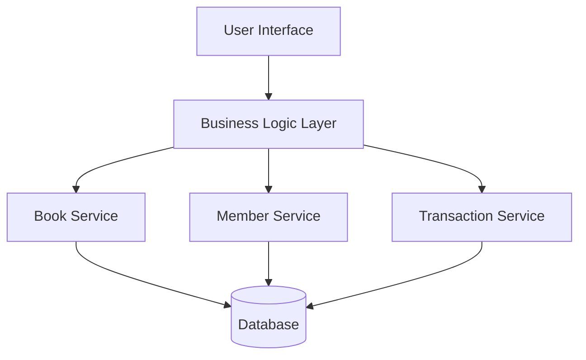

# System Architecture

## Architecture Style

The system uses a 3-tier layered architecture:

1. Presentation Layer
2. Business Logic Layer
3. Data Layer

---

# Components

## Presentation Layer
Handles user interaction.

Examples:
- Search screens
- Borrow forms
- Return forms

---

## Business Logic Layer
Processes application rules.

Examples:
- Fine calculation
- Borrow validation
- Availability checking

---

## Data Layer
Stores books, members, and transactions.

---

# Architecture Diagram

