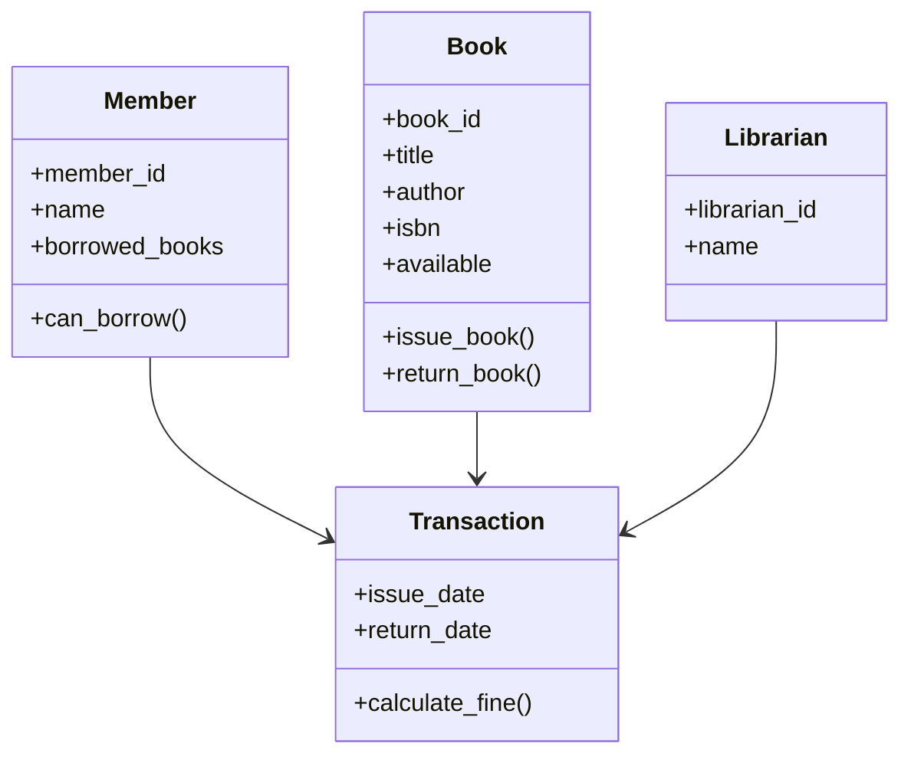
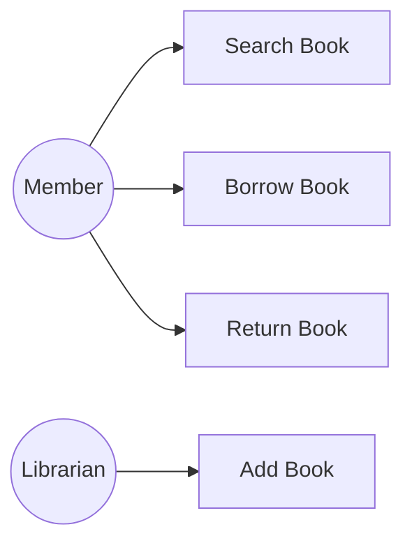
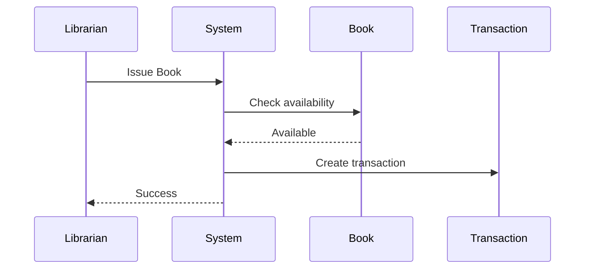
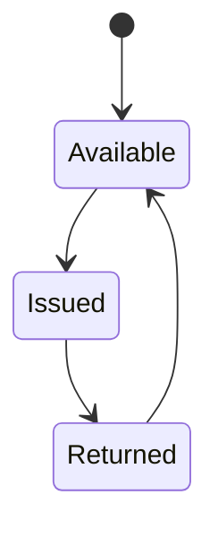

# Object-Oriented Analysis

# Main Classes

## Book
Attributes:
- book_id
- title
- author
- isbn
- available

Methods:
- issue_book()
- return_book()

---

## Member
Attributes:
- member_id
- name
- borrowed_books

Methods:
- can_borrow()

---

## Librarian
Attributes:
- librarian_id
- name

---

## Transaction
Attributes:
- issue_date
- return_date

Methods:
- calculate_fine()

---

# Class Diagram

---

# Use Case Diagram

---

# Sequence Diagram — Issue Book

---

# State Diagram — Book Lifecycle

