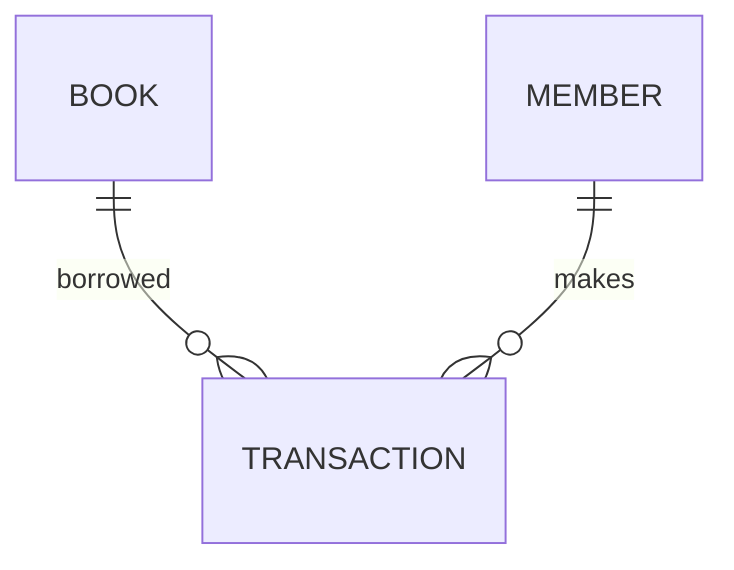

# Data Modeling

## Main Entities

### Book
- book_id
- title
- author
- isbn

### Member
- member_id
- name

### Transaction
- issue_date
- return_date

---

# ER Diagram

---

# Functional Model

## Search Book
Input:
- title

Process:
- search catalog

Output:
- matching books

---

## Borrow Book
Input:
- member_id
- book_id

Process:
- validate member
- validate availability

Output:
- issue confirmation

---

# Behavioral Model

## Book States

- Available
- Issued
- Returned